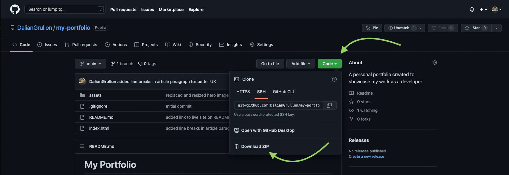

# E-commerce Backend


<br>

## Description

E-commerce Backend is a server-side application and database that listens to various HTTP requests to perform `CRUD` operations in a `MySQL` database via the Sequelize `ORM`. 

In creating this project, I learned a lot about creating Models using the Sequelize ORM and using those models via routes to perform CRUD operations in a database. I also learned about complex associations, such as one-to-one, one-to-many, many-to-many.

<br>

## Table of Contents

- [Installation](#installation)
- [Usage](#usage)
- [Technology](#technology)
- [License](#license)

<br>

## Installation




3. Once unzipped, ensure that MySQL is installed and hosting a live server

4. Open the `connection.js` file in the `config` directory and edit line 7 with your MySQL server information to ensure a proper connection. You can also create a `.env` file and include:

```
  DB_NAME = 'database name'
  DB_USER = 'Your username'
  DB_PASSWORD = 'Your password'
```

5. Run the `schema.sql` file in either DBeaver or via the command-line to initiate the database.

6. Run the following commands to  install all dependencies, seed the database, and start the application

```
npm install

npm run seed

npm start
```

<br>

## Usage

[Video Walkthrough](https://drive.google.com/file/d/1QUnv6kkLLBcoRp6kbjjFZD1lf71c8uzd/view?usp=sharing)

This backend application can be attached to a front-end application to launch an e-commerce platform that will load products by categories and tags.

<br>

## Technology
Listed below is all of the technology I used for this project:
- Node.js
- Express.js
- MySQL
- Sequelize (ORM)

<br>

## License

    Copyright © 2022 Dalian Grullon

    Permission to use, copy, modify, and/or distribute this software for any purpose with or without fee is hereby granted, provided that the above copyright notice and this permission notice appear in all copies.

    THE SOFTWARE IS PROVIDED "AS IS" AND THE AUTHOR DISCLAIMS ALL WARRANTIES WITH REGARD TO THIS SOFTWARE INCLUDING ALL IMPLIED WARRANTIES OF MERCHANTABILITY AND FITNESS. IN NO EVENT SHALL THE AUTHOR BE LIABLE FOR ANY SPECIAL, DIRECT, INDIRECT, OR CONSEQUENTIAL DAMAGES OR ANY DAMAGES WHATSOEVER RESULTING FROM LOSS OF USE, DATA OR PROFITS, WHETHER IN AN ACTION OF CONTRACT, NEGLIGENCE OR OTHER TORTIOUS ACTION, ARISING OUT OF OR IN CONNECTION WITH THE USE OR PERFORMANCE OF THIS SOFTWARE.
